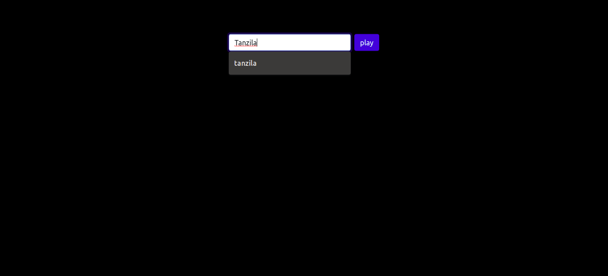
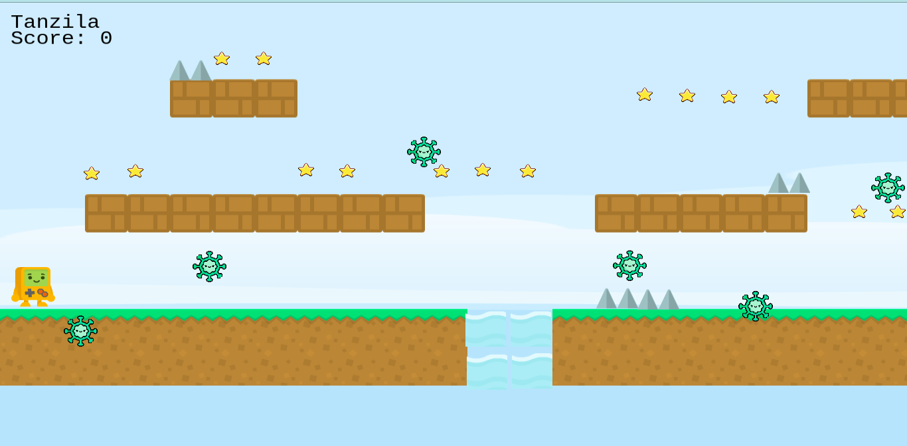
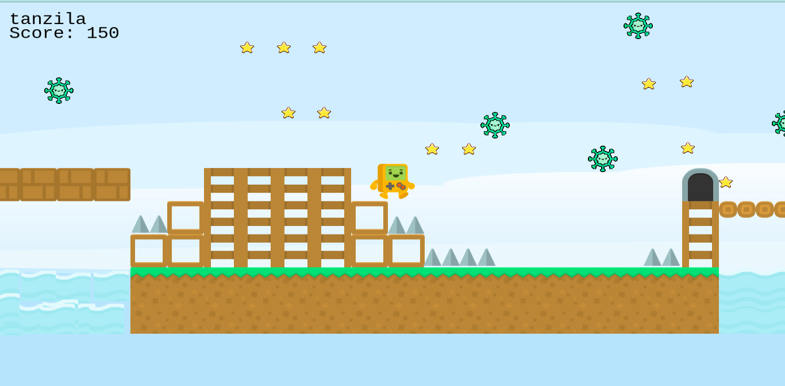
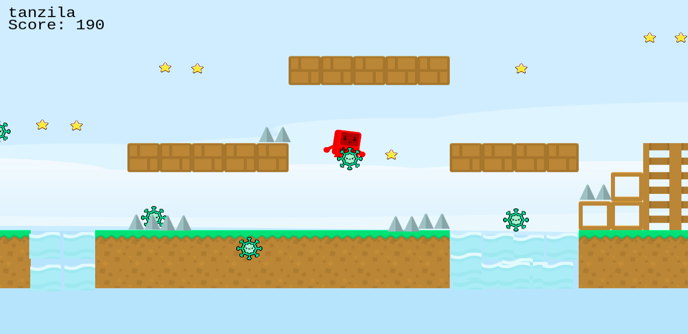
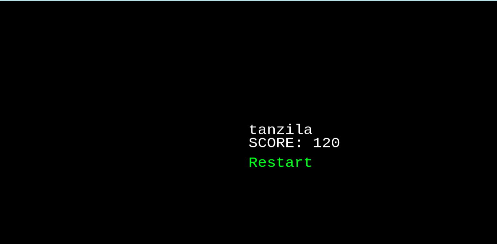

# Phaser Platform Game

[Click here to view live demo](https://tanzila-abedin.github.io/super-runner/)

A platform game built with Phaser JS.
In the game player can collect stars while avoiding enemy(GERMS) objects and collision with spikes. To move in different directions player can make use of arrow keys.

# Game Instructions 

***1. Start the game by typing out your name and click on play***

***2. Player may move forward with RIGHT key and jump with UP key***

***3. Player may collect stars to increase score while moving forward***

***4 player should avoid collision with the spikes and falling in the river as it will reduce their scores***

***5 player should avoid collision with the germs enemy object as it will end the game***

***6 As the game ends player score will appear on the screen***

***7 To view the top most scores player can visit the SCORE secene.*** 

## Additional description about the project and its features.

View the GGD [here](GDD.md)

## Built With

- JavaScript
- Phaser

## Getting Started

- Download or clone this repo by using `git clone `
- Run `npm install`
- Run `npm run build` to bundle the files in the src folder & product ouput in build folder
- Run `npm run watch` & open live server from index.html inside the src folder
- To test run `npm test`

## Author

👤 **Tanzila**

- GitHub: [@githubhandle](https://github.com/tanzila-abedin)
- Twitter: [@twitterhandle](https://twitter.com/TanzilaAbedin)
- LinkedIn: [Profile](https://www.linkedin.com/in/tanzila-abedin-331440b2/)

## 🤝 Contributing

Contributions, issues, and feature requests are welcome!

Feel free to check the [issues page](../../issues/).

## Show your support

Give a ⭐️ if you like this project!

## Acknowledgments

- Hat tip to anyone whose code was used
- Inspiration
- etc

## 📝 License

This project is [MIT](LICENSE) licensed.
